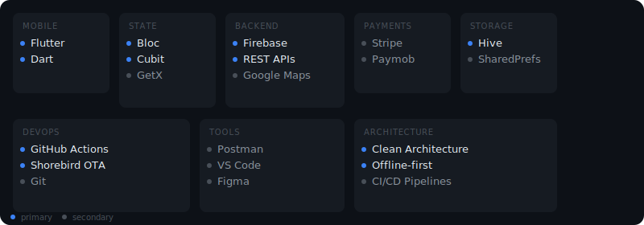

<div align="center">

<!-- Dynamic Typing SVG -->
[](https://git.io/typing-svg)

<p align="center">
  <a href="https://www.linkedin.com/in/mohamed-osman-54237b259/" target="_blank">
    
  </a>
  <a href="mailto:mohamedabdoosman12@gmail.com">
    
  </a>
</p>


</div>

---

## 👨‍💻 About Me

> **Flutter Engineer** with 3+ years building production-grade mobile systems at **ZITS** — not just apps, but scalable architectures deployed to real users across Egypt and beyond.

I obsess over:
- 🏗️ **Systems that scale** — clean architecture that survives long-term growth
- ⚡ **Performance that matters** — fewer crashes, faster releases, predictable load
- 🔄 **Automation-first delivery** — CI/CD pipelines that remove human bottlenecks
- 📦 **Offline-first UX** — apps that work regardless of connectivity

---

## 🛠️ Tech Stack



---

## 📱 Production Apps

<details>
<summary><b>🍔 Menuhat — Food Ordering Platform</b></summary>
<br>

Scalable food ordering system built with marketplace-level architecture. Handles real-time user flow, ordering lifecycle, and multi-vendor management.

**Key engineering decisions:**
- Real-time state sync using Bloc stream architecture
- Optimistic UI updates for zero-latency perceived performance
- Paginated API calls with local caching to reduce server load

[](https://play.google.com/store/apps/details?id=com.zits.menuhat)
[](https://apps.apple.com/eg/app/menuhat/id6749852444)

</details>

<details>
<summary><b>🧾 Smart Cashier — POS & Inventory System</b></summary>
<br>

Production-grade point-of-sale system for real business environments. Built for reliability under transactional load with focus on speed and data integrity.

**Key engineering decisions:**
- Offline-first architecture ensures operations continue without connectivity
- Local transaction queue with background sync
- Clean separation of domain logic from UI for testability

[](https://play.google.com/store/apps/details?id=com.zits.smart)
[](https://apps.apple.com/eg/app/smart-cashier/id6757008381)

</details>

<details>
<summary><b>💰 Money Flow — Offline-First Expense Tracker</b></summary>
<br>

Personal finance app with voice-powered expense entry. Designed around zero-latency UX — all reads/writes go to local Hive DB first, sync happens in background.

**Key engineering decisions:**
- Voice input with NLP-powered amount and category extraction
- Hive-based local-first architecture, no loading states for core flows
- Designed to work fully offline, sync when connected

[](https://play.google.com/store/apps/details?id=com.mohamed.moneyflow)

</details>

---

## 📊 Impact Snapshot

```
📱   3+ production apps live on Google Play & App Store
⚙️  CI/CD pipelines eliminating manual release overhead
💾  Offline-first systems with Hive caching strategies
🔔  Scalable push notification systems via Firebase
🚀  Shorebird OTA updates for hotfix delivery without store review
```

---

## 📈 GitHub Stats

<div align="center">

[](https://git.io/streak-stats)

</div>

---

## 🧠 Engineering Philosophy

```dart
class EngineeringMindset {
  final List<String> priorities = [
    'fewer crashes over clever features',
    'faster releases over perfect code',
    'simpler maintenance over premature optimization',
    'predictable scaling over speculative architecture',
  ];

  final String approach = 'Build systems that survive growth — not just demos.';
}
```

---

<div align="center">
  <sub>Open to remote & hybrid opportunities | Available for senior Flutter roles</sub>
</div>
